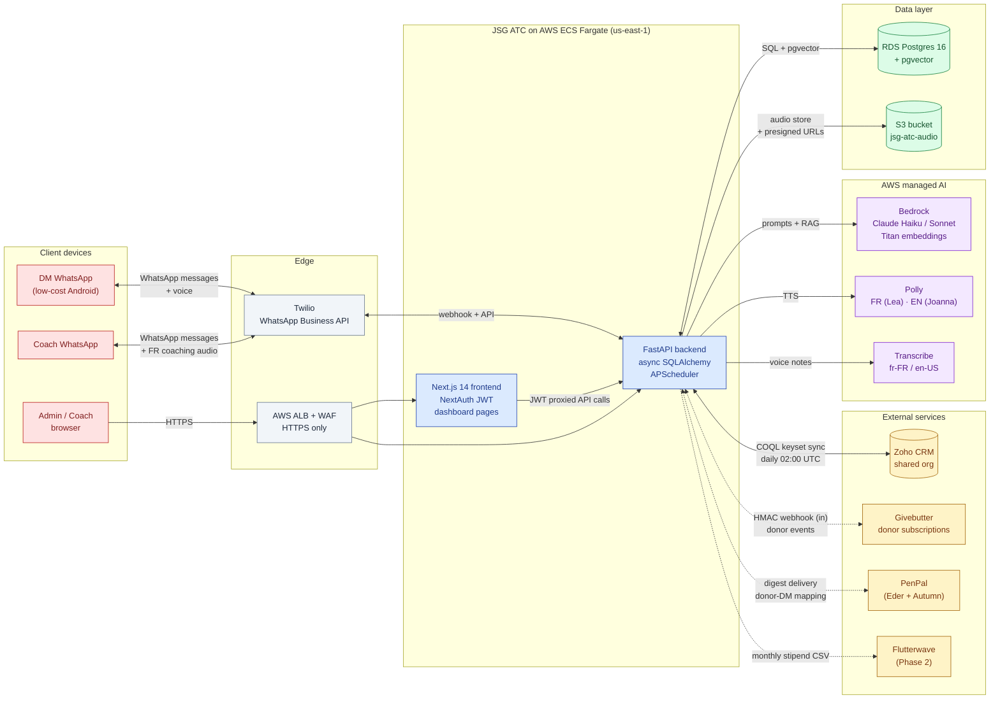

# JSGo ATC — System Architecture

Components and connections inside the ATC platform. For data movement see dataflow.md; for the Postgres schema see schema.md.

**Legend.** ATC services · Datastore · AWS managed AI · External service · Client device.

