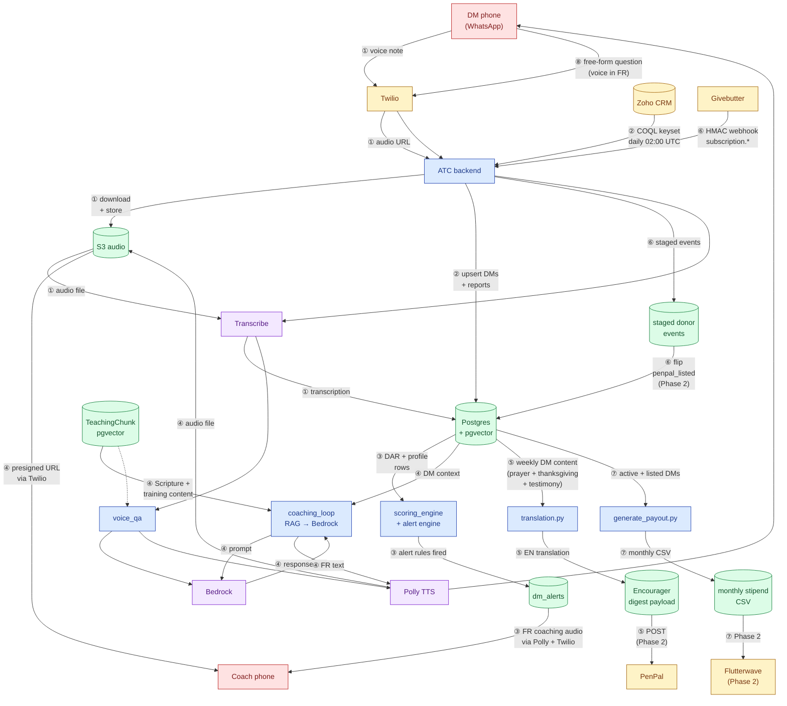

# JSGo ATC — Data Flow

How data moves through ATC. Eight named flows trace the data paths; the diagram shows their shared components and dependencies.

**Flows.** ① Voice intake · ② Daily Zoho sync · ③ Scoring + alerts · ④ Coaching loop · ⑤ Encourager digest · ⑥ Givebutter webhook · ⑦ Stipend CSV · ⑧ Voice Q&A.

## The eight flows in plain words

1. **Voice intake.** DM speaks → Twilio → ATC backend → S3 → Transcribe → field on Postgres.
2. **Daily Zoho sync.** 02:00 UTC pull of Contacts + Daily_Reports + Monthly_Reports into Postgres via COQL with keyset pagination.
3. **Scoring and alerts.** Postgres data feeds scoring_engine; alert rules fire, write to dm_alerts; FR coaching audio goes to the coach via Polly + Twilio.
4. **Coaching loop.** Per-DM context plus the three-tier RAG corpus (Scripture, JSG training, cultural) feeds Bedrock to generate a coaching prompt; the response is voiced by Polly and delivered to the coach.
5. **Encourager digest.** Weekly DM content (prayer + thanksgiving + testimony) is translated FR→EN, packaged into a digest payload, and POSTed to PenPal in Phase 2.
6. **Givebutter webhook.** Donor subscription events arrive via HMAC-signed webhook, stage to a queue, and flip penpal_listed on the matched DM once PenPal donor-DM mapping is live (Phase 2).
7. **Stipend CSV.** Monthly generator produces a provider-agnostic CSV from active, listed DMs; Phase 2 feeds Flutterwave.
8. **Voice Q&A.** Free-form DM question → Transcribe → voice_qa retrieves from RAG, generates via Bedrock, voices via Polly, returns to DM. Citations stored on QAExchange.sources.
