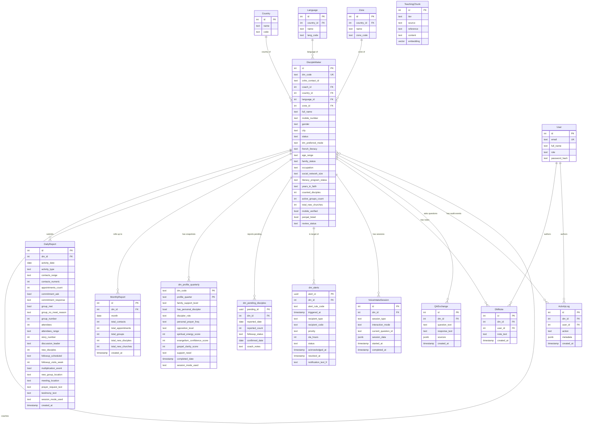

# JSGo ATC — Database Schema

Postgres with pgvector. DiscipleMaker is the centre; everything else hangs off it. New tables from migrations 018 to 020 are noted below.

## What this diagram shows and what it leaves out

- **Centre of the schema is DiscipleMaker.** Every meaningful row in the application is connected to a DM, directly or via a session record.
- **New tables from the Phase 1 build** are `dm_profile_quarterly` (migration 018), `dm_pending_disciples` (migration 019), and `dm_alerts` (migration 020). These appear as separate boxes; everything else was already in place through migration 015.
- **The dm_pending_disciples table is the methodological centrepiece.** Every donor-facing disciple count flows through its `confirmed` status. See ADR-0002 for the rationale.
- **pgvector embeddings live on TeachingChunk.** RAG retrieval queries against the `embedding` column using cosine similarity. Tier A is Scripture plus Statement of Faith, Tier B is JSG training, Tier C is cultural notes (currently empty).
- **dm_profile_quarterly has a composite primary key** on `dm_code` plus `profile_quarter` (e.g. `2026-Q2`). One row per DM per quarter.
- **LT tables are NOT shown here.** They live in Zoho, not Postgres. See PRD-3 when LTC scope is activated.
- **Settings, audit-only logs, and similar housekeeping tables are omitted for clarity.** They exist but don't drive the data model.
